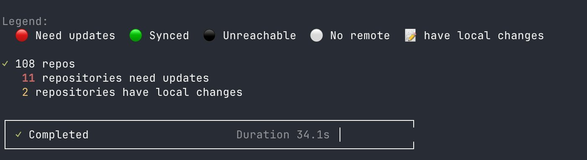
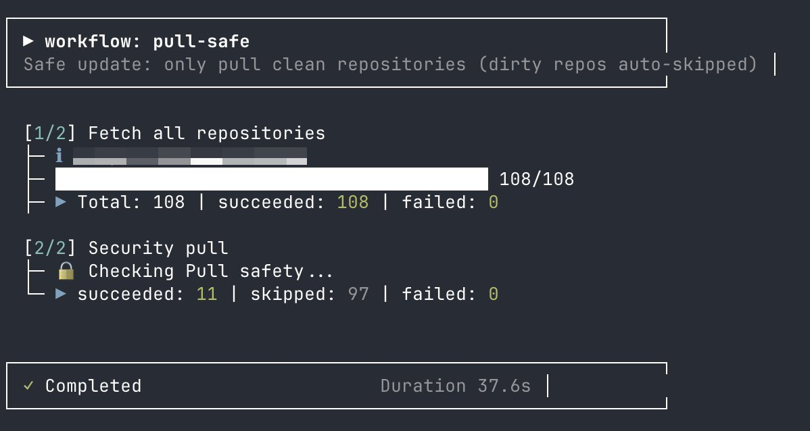

<div align="center">

# GetLatestRepo

[](https://www.rust-lang.org)
[](https://github.com/xcjy8/GetLatestRepo/actions)
[](LICENSE)

**用 Rust 编写的高效、优雅的本地 Git 仓库管理工具。**

[English](README.md) · [简体中文](README.zh-CN.md)

</div>

---

## ✨ 功能特性

- 🔍 **递归扫描** — 秒级发现指定目录下的所有 Git 仓库。
- ⚡ **并发 Fetch** — 支持自定义并发数，每个请求独立配置代理，零全局环境变量污染。
- 🛡️ **安全第一** — `pull-safe` 自动跳过有本地变更的仓库；`pull-force` 自动 stash → pull → pop。Fetch/Pull 前内置安全扫描，检测删库风险、敏感文件变更、可疑代码和未知提交者。
- 📊 **精美报告** — 支持终端表格、HTML 和 Markdown 三种输出，按日期自动归档。
- 🔄 **工作流引擎** — 内置 `daily`、`check`、`report`、`ci`、`pull-safe`、`pull-force` 六大工作流，轻松自动化日常操作。
- 🗃️ **SQLite 缓存** — 启用 WAL 模式，扫描结果持久化，避免无意义的重复扫描。
- 🔒 **进程锁** — 自动防止多实例同时运行，避免数据冲突。
- 🌐 **代理支持** — 通过 `--proxy` 或 `--proxy-url` 为每个请求单独设置代理。

---

## 📸 截图

<p align="center">
  
</p>

<p align="center">
  
</p>

<p align="center">
  
</p>

---

## 🚀 安装

### 从源码编译

```bash
# 克隆仓库
git clone https://github.com/xcjy8/GetLatestRepo.git
cd GetLatestRepo

# 编译 Release 版本
cargo build --release

# 可选：安装到 /usr/local/bin
sudo cp target/release/getlatestrepo /usr/local/bin/
```

### 环境要求

- Rust 1.70 或更高版本
- 系统中已安装 `git`

---

## 🏁 快速开始

```bash
# 1. 初始化扫描源
getlatestrepo init ~/projects

# 2. 运行日常检查工作流（扫描 + fetch + 状态汇总）
getlatestrepo workflow daily

# 3. 生成 HTML 报告
getlatestrepo workflow report
```

---

## 📖 命令速查

### 全局参数

以下参数在每个命令下都可用：

| 参数 | 说明 |
|------|-------------|
| `--proxy` | 启用默认代理（`http://127.0.0.1:7890`）。 |
| `--proxy-url <URL>` | 指定自定义代理地址（例如 `http://127.0.0.1:1080`）。 |
| `--no-security-check` | 禁用 fetch/pull 前的安全扫描。 |

### 子命令

| 命令 | 说明 |
|---------|-------------|
| `getlatestrepo init <path>` | 添加一个扫描根目录。 |
| `getlatestrepo scan` | 递归扫描 Git 仓库并写入本地数据库。 |
| `getlatestrepo fetch` | 并发拉取所有跟踪仓库的远程更新。 |
| `getlatestrepo status <path>` | 查看单个仓库的详细信息。 |
| `getlatestrepo config` | 管理扫描源、忽略规则和配置项。 |
| `getlatestrepo workflow <name>` | 运行内置或自定义工作流。 |
| `getlatestrepo discard` | 交互式丢弃指定仓库的本地修改。 |

### 子命令选项

#### `init`

```bash
getlatestrepo init <PATH>
```

| 参数 | 说明 |
|----------|-------------|
| `<PATH>` | 要扫描的 Git 仓库根目录。 |

#### `scan`

```bash
getlatestrepo scan [OPTIONS]
```

| 选项 | 说明 |
|--------|-------------|
| `--fetch` | 扫描前先执行 fetch。 |
| `-o, --output <FORMAT>` | 输出格式：`terminal`（默认）、`html` 或 `markdown`。 |
| `--out <PATH>` | 自定义输出文件路径（默认自动生成）。 |
| `-d, --depth <N>` | 限制扫描深度。 |
| `-j, --jobs <N>` | 并发数限制（默认：5）。 |

#### `fetch`

```bash
getlatestrepo fetch [OPTIONS]
```

| 选项 | 说明 |
|--------|-------------|
| `-j, --jobs <N>` | 并发数限制（默认：5）。 |
| `-t, --timeout <SECS>` | 单次 fetch 超时秒数（默认：30）。 |

#### `status`

```bash
getlatestrepo status <PATH> [OPTIONS]
```

| 选项 | 说明 |
|--------|-------------|
| `--diff` | 显示 diff 内容。 |

#### `config`

```bash
getlatestrepo config <SUBCOMMAND>
```

| 子命令 | 说明 |
|------------|-------------|
| `add <PATH>` | 添加新的扫描源。 |
| `list` | 列出所有已配置的扫描源。 |
| `remove <PATH_OR_ID>` | 按路径或 ID 移除扫描源。 |
| `ignore <PATTERNS>` | 设置全局忽略规则（逗号分隔）。 |
| `path` | 显示配置文件所在位置。 |

#### `workflow`

```bash
getlatestrepo workflow [NAME] [OPTIONS]
```

| 选项 | 说明 |
|--------|-------------|
| `--list` | 列出所有可用工作流。 |
| `--dry-run` | 仅显示执行计划，不实际执行。 |
| `--silent` | 静默模式（仅返回 exit code）。 |
| `-j, --jobs <N>` | 覆盖默认并发数。 |
| `-t, --timeout <SECS>` | 覆盖默认超时秒数。 |
| `--yes` | 自动确认提示（仅 `pull-safe` 有效）。 |
| `--diff-after` | Pull 后显示新提交列表（仅 `pull-safe` / `pull-force` 有效）。 |
| `--no-pull-guard` | 禁用 pull 安全检查（仅 `pull-safe` 有效）。 |

#### `discard`

```bash
getlatestrepo discard [PATH] [OPTIONS]
```

| 选项 | 说明 |
|--------|-------------|
| `--yes` | 跳过确认提示。 |

### 内置工作流

| 工作流 | 作用 |
|----------|--------------|
| `daily` | Fetch → 扫描 → 输出简洁状态汇总。 |
| `check` | 仅扫描（不 fetch），显示需要关注的仓库。 |
| `report` | Fetch → 扫描 → 生成 HTML/Markdown 报告。 |
| `ci` | Fetch → 扫描 → 检查 behind（如有 behind 则返回错误码）。 |
| `pull-safe` | Fetch → 安全 Pull（仅快进合并，跳过脏仓库）。 |
| `pull-force` | Fetch → 强制 Pull（stash → pull → pop）。 |

---

## 📁 报告输出

生成的报告会自动归档到：

```
reports/YYYY/MM/DD/getlatestrepo-report-YYYYMMDD-HHMMSS.<ext>
```

`reports/latest.html` 软链接始终指向最新的 HTML 报告。

---

---

## 🤝 贡献指南

欢迎提交 Issue 和 Pull Request！

---

## 许可证

本项目采用双重许可：

- **AGPL-3.0-or-later** — 适用于开源及非商业用途。完整文本请见 [LICENSE](LICENSE)。
- **商业授权** — 如需在商业产品或服务中以闭源方式使用本软件，请联系作者获取商业授权。

未经许可，禁止将本软件用于闭源商业用途。
